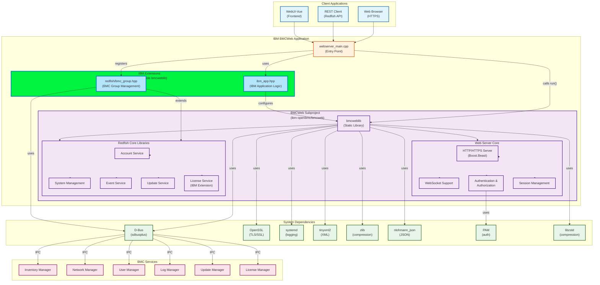

# IBM BMCWeb Project

This project uses bmcweb from [ibm-openbmc/bmcweb](git@github.com:ibm-openbmc/bmcweb.git) as a subproject dependency.

## Architecture Overview



### Component Description

#### IBM BMCWeb Application Layer
- **webserver_main.cpp**: Entry point that initializes and starts the BMCWeb server
- **IBM Extensions (Outside bmcweblib)**:
  - **redfish/bmc_group.hpp**: BMC Group Management - Custom Redfish endpoint implementation for managing BMC groups, implemented outside the bmcweblib to allow IBM-specific customizations
  - **ibm_app.hpp**: IBM-specific application logic and configuration

#### BMCWeb Subproject
- **bmcweblib**: Core web server implementation using Boost.Beast for HTTP/HTTPS
- **Web Server Core**: HTTP/HTTPS server, WebSocket support, authentication, and session management
- **Redfish Core**: Standard Redfish API endpoints for BMC management (Account, System, Event, Update, License services)

#### System Integration
- **D-Bus (sdbusplus)**: Inter-process communication with BMC services
- **OpenSSL**: Provides TLS/SSL encryption for HTTPS connections
- **systemd**: System logging and service management integration
- **Client Applications**: Web browsers, REST clients, and the WebUI-Vue frontend

### Data Flow

1. Client sends HTTPS request to BMCWeb server
2. BMCWeb authenticates request using PAM
3. Request is routed to appropriate Redfish endpoint
4. Redfish handler communicates with BMC services via D-Bus
5. Response is formatted as JSON and returned to client

## Project Structure

```
ibm-bmcweb/
├── meson.build                    # Main build configuration
├── redfish/                       # Redfish extensions
│   └── bmc_group.hpp             # BMC group definitions
├── service/                       # Systemd service files
│   └── ibm-bmweb.service.in      # Service template
├── src/                           # Source files
│   ├── boost_asio.cpp            # Boost ASIO implementation
│   ├── ibm_app.hpp               # IBM application header
│   ├── ibmwebserver_run.cpp      # IBM webserver implementation
│   ├── ibmwebserver_run.hpp      # IBM webserver header
│   └── webserver_main.cpp        # Main entry point
└── subprojects/                   # Meson subproject dependencies
    ├── bmcweb.wrap               # BMCWeb subproject (ibm-openbmc/bmcweb)
    └── boost                      # Boost subproject
```

## Prerequisites

- Meson >= 1.3.0
- C++ compiler with C++23 support (GCC 14.2+ or Clang 17+)
- Required system libraries:
  - openssl
  - libzstd
  - sdbusplus
  - systemd
  - tinyxml2
  - zlib
  - nlohmann_json
  - pam

## Build Instructions

### Initial Setup

```bash
cd /mnt/hgfs/work/work/ibm/sources/ibm-bmcweb

meson setup builddir \
  -Dbmcweb:werror=false \
  -Dbmcweb:tests=disabled \
  -Dbmcweb:audit-events=disabled \
  -Dbmcweb:hypervisor-serial-socket=disabled \
  -Dbmcweb:bmc-shell-socket=disabled
```

### Build

```bash
meson compile -C builddir ibm-bmcweb
```

### Clean Build (if needed)

```bash
rm -rf builddir
meson setup builddir \
  -Dbmcweb:werror=false \
  -Dbmcweb:tests=disabled \
  -Dbmcweb:audit-events=disabled \
  -Dbmcweb:hypervisor-serial-socket=disabled \
  -Dbmcweb:bmc-shell-socket=disabled
meson compile -C builddir ibm-bmcweb
```

### Remote Build (via SSH)

```bash
ssh myubuntu "cd /mnt/hgfs/work/work/ibm/sources/ibm-bmcweb && \
  meson setup builddir \
    -Dbmcweb:werror=false \
    -Dbmcweb:tests=disabled \
    -Dbmcweb:audit-events=disabled \
    -Dbmcweb:hypervisor-serial-socket=disabled \
    -Dbmcweb:bmc-shell-socket=disabled && \
  meson compile -C builddir ibm-bmcweb"
```

## Build Configuration Options

| Option | Value | Description |
|--------|-------|-------------|
| `bmcweb:werror` | `false` | Disables treating warnings as errors |
| `bmcweb:tests` | `disabled` | Skips building tests |
| `bmcweb:audit-events` | `disabled` | Disables audit events feature (requires audit library) |
| `bmcweb:hypervisor-serial-socket` | `disabled` | Disables hypervisor serial socket (depends on audit-events) |
| `bmcweb:bmc-shell-socket` | `disabled` | Disables BMC shell socket (depends on audit-events) |

## Build Output

- **Executable**: `builddir/ibm-bmcweb`
- **Size**: ~397MB (debug build with symbols)
- **Dependencies**: Links with bmcweblib static library from the bmcweb subproject

## Reconfigure Options

To change build options after initial setup:

```bash
meson configure builddir -Dbmcweb:option=value
meson compile -C builddir ibm-bmcweb
```

## Troubleshooting

### Missing Dependencies

If you encounter missing dependency errors, ensure all required system libraries are installed:

```bash
# Ubuntu/Debian
sudo apt-get install libssl-dev libzstd-dev libsystemd-dev \
  libtinyxml2-dev zlib1g-dev nlohmann-json3-dev libpam0g-dev

# For sdbusplus, you may need to build from source or install from OpenBMC repositories
```

### Compiler Warnings

The build may show warnings from GCC 14.2's strict static analysis (null-pointer dereference warnings in boost and bmcweb code). These are false positives and can be safely ignored as we've disabled `-Werror`.

### Subproject Updates

To update the bmcweb subproject to the latest version:

```bash
cd subprojects
rm -rf bmcweb
cd ..
meson setup --wipe builddir
```

## Notes

- The project uses bmcweb as a header-only library with a static library (bmcweblib) for compiled sources
- The `webserver_run.cpp` in `src/` is a reference copy; the actual implementation comes from bmcweblib
- The `webserver_main.cpp` provides a simple main() function that calls the run() function from bmcweb